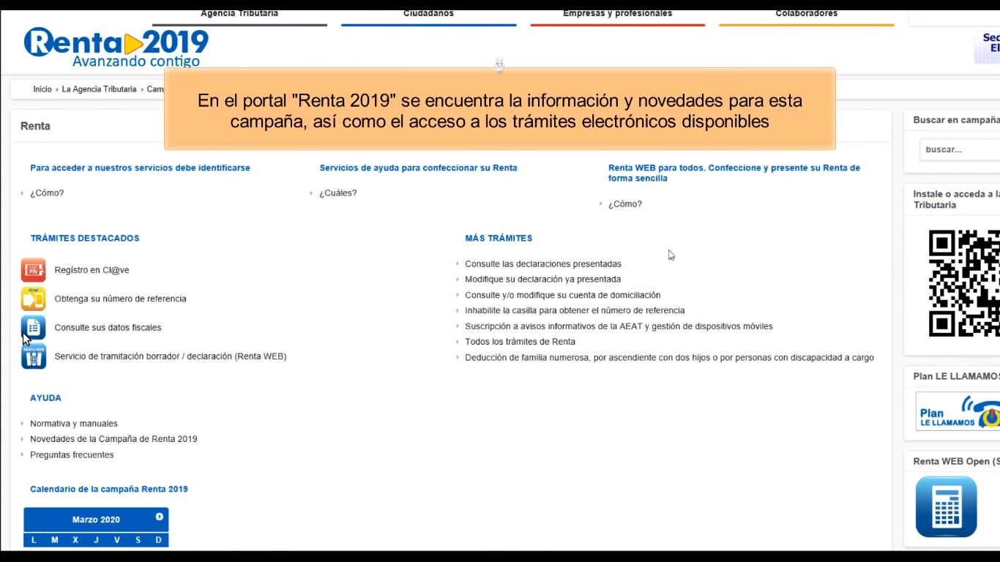
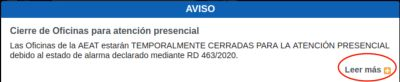
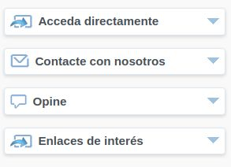

# Seminario 4
## Principio Perceptible

### Participantes
Enrique Manuel Pedroza Castillo (alu0100886351@ull.edu.es)

Yeixon Reinaldo Morales Gonzalez (alu0101133324@ull.edu.es)

José Javier Díaz González (alu0101128894@ull.edu.es)

Alejandro Curbelo García (alu0101233581@ull.edu.es)

----------------------------------------------------------

Pauta  |  Descripción |   Imagen
:----: | :----------: | :---------:
1.1                     | El criterio 1.1.1 (A) donde todo contenido no textual tiene una alternativa textual para el mismo propósito se cumple pues el único material no textual son elementos decorativos o son imágenes de texto | Imagen que funciona como enlace  Imagen que funciona como decoración 
1.2                     | Criterio 1.2.2 cumplido pues los elementos audiovisuales están acompañados siempre de subtítulos | 
1.3                     | El criterio 1.3.2 donde la secuencia en que se presenta el contenido afecta a su significado, se puede identificar por software la secuencia correcta de lectura se cumple pues se puede ver como la información está estructurada tanto en columnas como en tablas. | 
1.3                     | El criterio 1.3.3 donde las instrucciones para entender y manejar el contenido no dependen sólo de características sensoriales como forma, color, tamaño, ubicación visual, orientación o sonido. | 
1.3                     | El criterio 1.3.4 (AA) donde el contenido no obliga a ser visto en una única orientación también se cumple. | Antes       Después   

