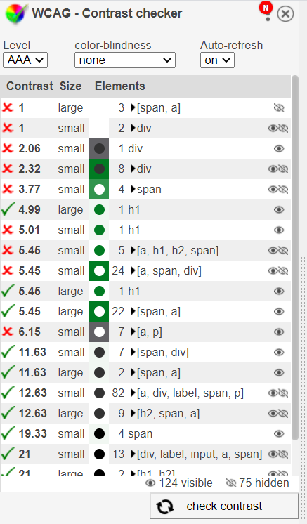
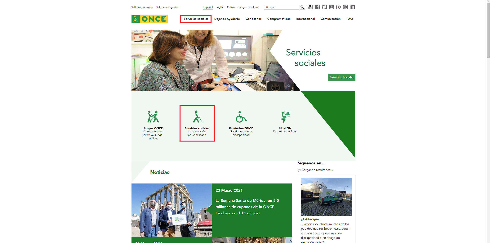
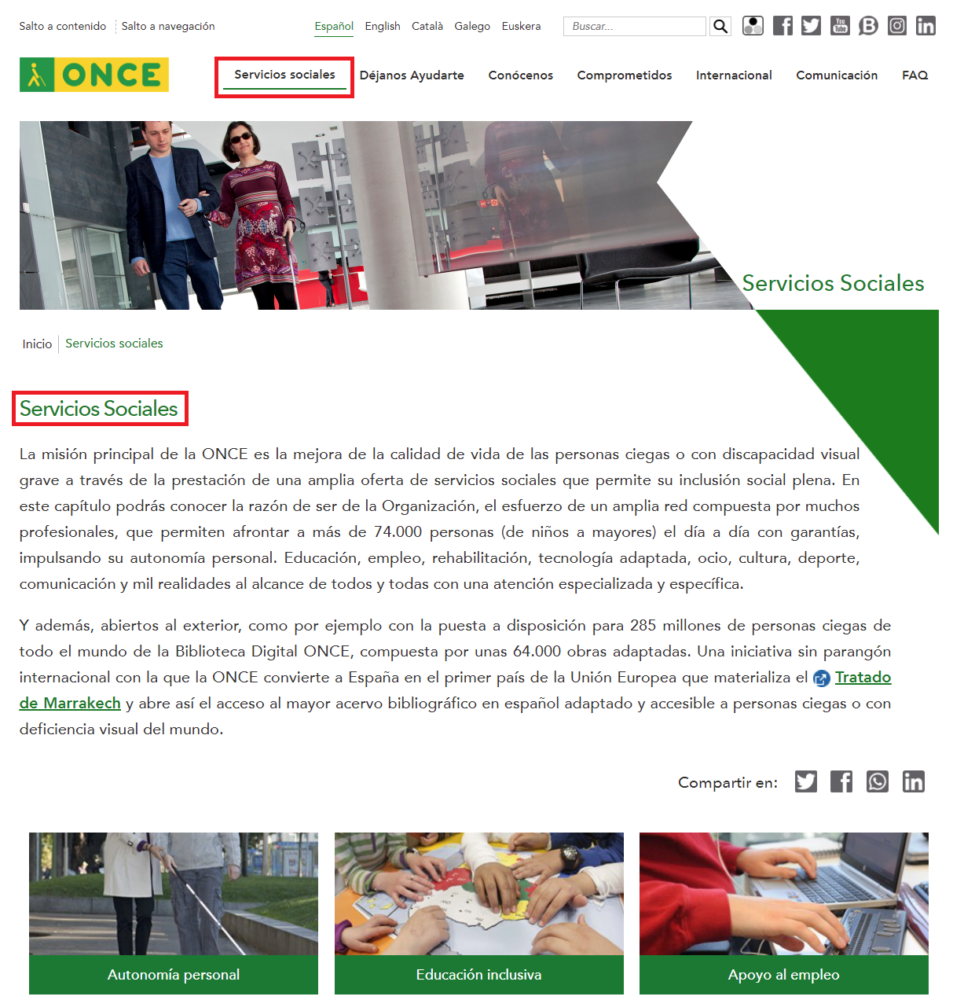
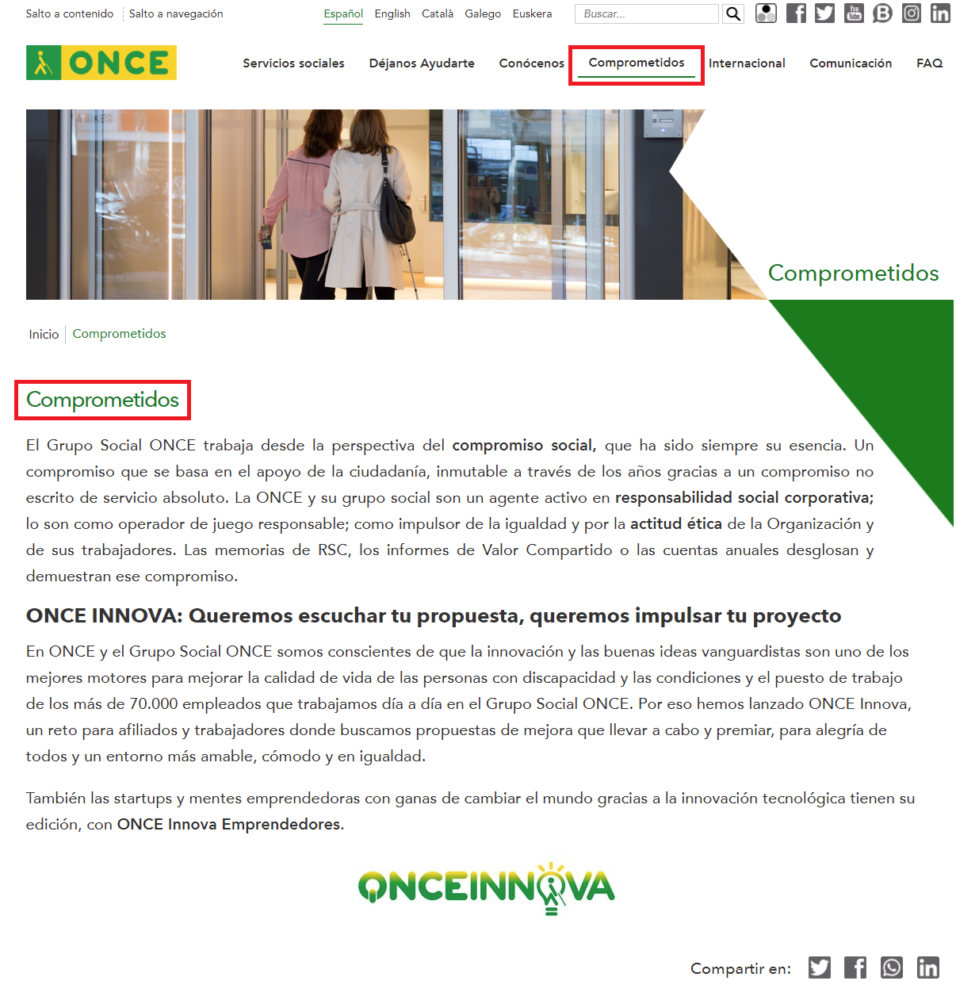

# Seminario 5

## Perceptible Operable

### Participantes

Enrique Manuel Pedroza Castillo (alu0100886351@ull.edu.es)

Yeixon Reinaldo Morales Gonzalez (alu0101133324@ull.edu.es)

José Javier Díaz González (alu0101128894@ull.edu.es)

Alejandro Curbelo García (alu0101233581@ull.edu.es)

----------------------------------------------------------

 

Para evaluar las diferentes pautas del perceptible operable hemos elegido el sitio web de la [once](https://www.once.es/)

 

Pautas (Operable) |  Criterios |   Imagen
:---------------: | :--------: | :---------:
2.1 | En la página se puede apreciar que todas las funciones son accesibles mediante el uso del teclado.   Criterio **2.1.3 AAA** | 
2.2 | Se nos permite parar el carrusel.   Criterio **2.2.2 A** | 
2.3 | Las páginas no contienen nada que destelle más de 3 veces por segundo.   Criterio **2.3.2 AAA** |  
2.4 | Dentro del sitio web se puede acceder a una página a través de varios caminos.   Criterio **2.4.5 AA** | 
2.4 | Se nos informa la ubicación donde nos encontramos en cada momento.   Criterio **2.4.8 AAA** |    
2.4 | Todo el contenido de la página está con encabezados.   Criterio **2.4.10 AAA** | 
